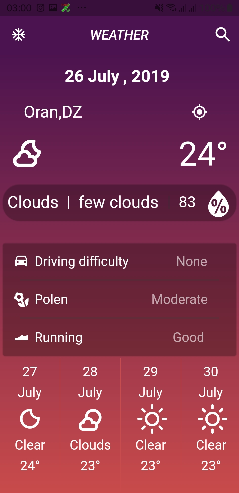

<h1 align="center">
   
  
   
  Clima - Simple & Colurful
   
</h1>

<h4 align="center">A minimal Weather mobile app made using <a href="https://flutter.dev" target="_blank">Flutter</a>.</h4>

  <a href="#key-features">Key Features</a> •
  <a href="#Overview">Overview</a> •

  
  
 
  

## Key Features

* Easily Get your Location Using The **GPS**
* **RealTime** And 16 Days Forecast.
* You Can just Look For Your City **Manualy**. 
* **Advices** About Driving Sports And Polen

## Overview
* The Data Is From 
* The Location Is Fetched Using  **Recomended** Package
* The Icons Are From  and [Flutter Icons](https://pub.dev/packages/flutter_icons)

